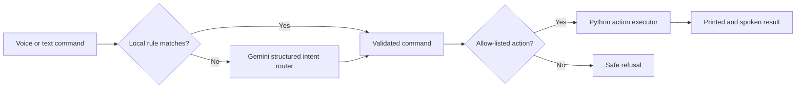

# Jarvis AI Assistant

Jarvis is a Python voice and text assistant that turns natural-language requests
into a small set of safe, allow-listed actions. It combines speech recognition,
local automation, persistent memory, and Gemini structured output.

## What it can do

- Listen for the **Jarvis** wake word and accept spoken commands.
- Run in text mode for quick testing and demonstrations.
- Open approved websites: YouTube, Google, Instagram, LinkedIn, Facebook, GitHub,
  WhatsApp Web, and Telegram Web.
- Prepare a WhatsApp message for a saved contact, ask for confirmation, and open
  the chat with the message filled in for manual sending.
- Search the web, play songs from a local library, and read news headlines.
- Remember simple preferences such as a name or favorite song.
- Tell the local time and date without using the internet.
- Report current weather and today's rain chance for a spoken city, using
  Open-Meteo without an API key.
- Play a saved favorite song, pause/resume media, navigate back without closing
  the browser, close only the current tab, or explicitly close a window.
- Run a personalized “Start my day” routine with time, date, weather, news,
  reminders, WhatsApp, LinkedIn, and favorite music.
- Use a responsive local dashboard with typed commands, one-click continuous
  browser listening, spoken replies, quick actions, live status, and reminder
  management.
- Use Gemini to understand flexible requests such as “Could you take me to LinkedIn?”
- Reject arbitrary programs, shell commands, file operations, credentials,
  purchases, unconfirmed messages, and other unsupported actions.

## How the AI integration works



Gemini never receives permission to execute arbitrary Python or shell commands. It
returns a validated JSON decision, and the local executor checks the target again
before performing an action.

## Setup on Windows

Requires Python 3.13 and a microphone for voice mode.

```powershell
py -3.13 -m venv .venv
.\.venv\Scripts\Activate.ps1
python -m pip install --upgrade pip
python -m pip install -r requirements.txt
Copy-Item .env.example .env
```

Create a Gemini API key in [Google AI Studio](https://aistudio.google.com/app/apikey),
then open `.env` and add it locally:

```dotenv
GEMINI_API_KEY=your_key_here
GEMINI_MODEL=gemini-3.5-flash-lite
```

Never commit `.env`. It is already excluded by `.gitignore`.

Copy `contacts.example.json` to `contacts.json`, then add contacts using their
international phone numbers. The real `contacts.json` is excluded from Git so
phone numbers are not uploaded to GitHub.

The news feature is optional. Add `NEWS_API_KEY` to `.env` only if you want it.
Weather does not need an API key. Set `DEFAULT_CITY=Goa` (or your city) in `.env`
for weather commands that do not contain a location.

## Run it

Voice mode (canonical entry point):

```powershell
python main_02.py
```

Local web dashboard:

```powershell
python web_app.py
```

The dashboard opens at `http://127.0.0.1:5000`. It runs only on the local
computer by default. Chrome or Edge is recommended for browser microphone input.
Click the microphone once to keep voice mode on for the current dashboard
session; click it again to stop. Jarvis pauses listening while processing and
speaking, then resumes automatically so it does not hear its own reply.
The dashboard uses the same Python microphone and Google speech-recognition
pipeline as terminal voice mode, so it also works in embedded browsers where
the browser's own Web Speech API is unreliable. Recognized speech appears in
the command box and is submitted automatically.

Voice recognition uses Google Speech Recognition with Indian English (`en-IN`),
not the Gemini API key. The microphone stream closes while Jarvis transcribes or
speaks so stale audio is not processed after listening resumes. For best results
during music playback, use headphones or keep the speaker volume low.

Say `back` or `go back` to navigate the foreground browser/app backward. Say
`close tab` or `close this page` to close only the current browser tab. A full
window is closed only by the explicit command `close window`.

Say `sleep`, `go to sleep`, or `सो जाओ` (`so jao`) to put dashboard voice
mode in **standby**.
Jarvis says goodbye and ignores ordinary commands, but keeps the
microphone active for `Hey Jarvis`, `Hello Jarvis`, or `Okay Jarvis`. After the
wake response, normal voice commands resume. Keep the Jarvis dashboard tab and
Flask server running; it can listen while another tab such as YouTube is in
front. Click the microphone while in standby to turn it fully off. Click it
again to start normal listening. Background browser-only speech recognition
is less reliable than the Python desktop microphone bridge. The wake response
may be delayed if the browser throttles the background tab, and closing or
reloading the dashboard tab stops voice mode.
Say `exit` or `stop listening` to turn voice mode fully off instead.

Run the dashboard without opening a browser automatically:

```powershell
python web_app.py --no-browser
```

Safe dashboard demo mode, which does not open websites or call NewsAPI:

```powershell
python web_app.py --dry-run
```

Test the spoken response without starting the microphone loop:

```powershell
python main_02.py --voice-test
```

Prepare common spoken responses once before a demo so they play immediately:

```powershell
python main_02.py --prepare-voice-cache
```

Interactive text mode:

```powershell
python main_02.py --text --mute
```

Test one command without opening a browser:

```powershell
python main_02.py --command "open youtube" --dry-run --mute
```

## Suggested demo

1. Run `python main_02.py --text --mute`.
2. Enter `open youtube` to demonstrate the fast local rule path.
3. Enter `could you take me to LinkedIn please` to demonstrate Gemini routing.
4. Enter `remember my name is Bablu`, then `what is my name`.
5. Enter `play my favorite song`, `pause`, `play`, and `back` to demonstrate
   the Windows media and navigation controls.
6. Enter `what time is it`, `what is today's date`, and `weather in Goa`.
7. Add a reminder: `remind me to practice my pitch`.
8. Enter `start my day` to demonstrate the complete morning routine.
9. Enter `send a WhatsApp message to Bablu saying Hello, I am coming`, then
   answer `yes` to open the prefilled chat. Press Send manually in WhatsApp.
10. Try an unsafe or unsupported request to demonstrate the guardrail.

## Start my day routine

Say or type `start my day`, `morning briefing`, or `good morning Jarvis`.
Jarvis will greet the saved user, report the current time and date, retrieve
weather and news, read local reminders, open WhatsApp and LinkedIn, and play the
saved favorite song. Each step is independent, so one unavailable service does
not prevent the remaining steps from running.

On the web dashboard, Jarvis finishes speaking the complete briefing before it
opens WhatsApp and LinkedIn and starts the favorite song. This prevents music
from overlapping the greeting, weather, news, and reminders. The voice-only CLI
keeps its existing behavior.

Reminders are stored locally in `data/reminders.json`. They can be created from
the dashboard or with commands such as `remind me to submit my application`.

For confirmation-first WhatsApp drafting, say or type a single command such as
`send a WhatsApp message to Mom saying I will call you later`. Jarvis reads the
message back and asks for confirmation. Answer `yes` to open WhatsApp with the
message filled in, or `no` to cancel. Jarvis intentionally leaves the final Send
button to the user and does not read incoming WhatsApp conversations.

## Run tests

```powershell
python -m unittest discover -s tests -v
```

The test suite uses dry-run mode, so it does not open websites or call the news API.

## Project status and limitations

- Speech-to-text currently uses Google Speech Recognition through the
  `SpeechRecognition` package and therefore needs internet access.
- Gemini routing requires a valid API key and is subject to Google's quota limits.
- Weather data is provided by Open-Meteo and requires an internet connection.
- The assistant intentionally supports a small action set. It is a safe prototype,
  not a general computer-control agent.
- `main_02.py` is the canonical entry point for running the assistant.

## Responsible development

This project was built as a learning project coded by me with the help of some AI coding tools.

