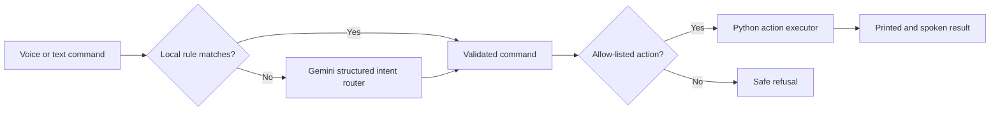

# Jarvis AI Assistant

Jarvis is a Python voice and text assistant that turns natural-language requests
into a small set of safe, allow-listed actions. It combines speech recognition,
local automation, persistent memory, and Gemini structured output.

## What it can do

- Listen for the **Jarvis** wake word and accept spoken commands.
- Run in text mode for quick testing and demonstrations.
- Open approved websites: YouTube, Google, Instagram, LinkedIn, Facebook, GitHub,
  and WhatsApp Web.
- Search the web, play songs from a local library, and read news headlines.
- Remember simple preferences such as a name or favorite song.
- Tell the local time and date without using the internet.
- Report current weather and today's rain chance for a spoken city, using
  Open-Meteo without an API key.
- Play a saved favorite song, pause/resume media, and close the foreground
  window with the same Windows shortcut as clicking its cross button.
- Use Gemini to understand flexible requests such as “Could you take me to LinkedIn?”
- Reject arbitrary programs, shell commands, file operations, credentials, purchases,
  messages, and other unsupported actions.

## How the AI integration works



Gemini never receives permission to execute arbitrary Python or shell commands. It
returns a validated JSON decision, and the local executor checks the target again
before performing an action.

## Setup on Windows

Requires Python 3.13 and a microphone for voice mode.

```powershell
py -3.13 -m venv .venv
.\.venv\Scripts\Activate.ps1
python -m pip install --upgrade pip
python -m pip install -r requirements.txt
Copy-Item .env.example .env
```

Create a Gemini API key in [Google AI Studio](https://aistudio.google.com/app/apikey),
then open `.env` and add it locally:

```dotenv
GEMINI_API_KEY=your_key_here
GEMINI_MODEL=gemini-3.8-flash
```

Never commit `.env`. It is already excluded by `.gitignore`.

The news feature is optional. Add `NEWS_API_KEY` to `.env` only if you want it.
Weather does not need an API key. Set `DEFAULT_CITY=Goa` (or your city) in `.env`
for weather commands that do not contain a location.

## Run it

Voice mode (canonical entry point):

```powershell
python main_02.py
```

Test the spoken response without starting the microphone loop:

```powershell
python main_02.py --voice-test
```

Prepare common spoken responses once before a demo so they play immediately:

```powershell
python main_02.py --prepare-voice-cache
```

Interactive text mode:

```powershell
python main_02.py --text --mute
```

Test one command without opening a browser:

```powershell
python main_02.py --command "open youtube" --dry-run --mute
```

## Suggested demo

1. Run `python main_02.py --text --mute`.
2. Enter `open youtube` to demonstrate the fast local rule path.
3. Enter `could you take me to LinkedIn please` to demonstrate Gemini routing.
4. Enter `remember my name is Bablu`, then `what is my name`.
5. Enter `play my favorite song`, `pause`, `play`, and `back` to demonstrate
   the Windows media and navigation controls.
6. Enter `what time is it`, `what is today's date`, and `weather in Goa`.
7. Try an unsafe or unsupported request to demonstrate the guardrail.

## Run tests

```powershell
python -m unittest discover -s tests -v
```

The test suite uses dry-run mode, so it does not open websites or call the news API.

## Project status and limitations

- Speech-to-text currently uses Google Speech Recognition through the
  `SpeechRecognition` package and therefore needs internet access.
- Gemini routing requires a valid API key and is subject to Google's quota limits.
- Weather data is provided by Open-Meteo and requires an internet connection.
- The assistant intentionally supports a small action set. It is a safe prototype,
  not a general computer-control agent.
- `main_02.py` is the canonical entry point for running the assistant.

## Responsible development

This project was built as a learning project with assistance from AI coding tools.
The architecture, integration, testing, and final behavior should be reviewed and
understood by the repository owner before publishing or demonstrating it.
